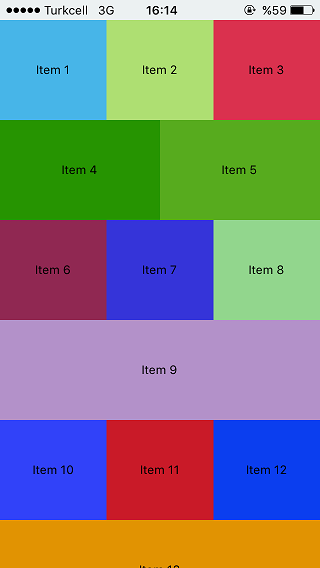

# react-native-variable-list
**Summary**
This component allows you to create different column numbered layouts. You can use any numbered patterns to render your component.

**Description**
React Native `FlatList` component only supports fixed number of components for each row and doesn't allow any alternating columns for rows. This component mostly uses `FlatList` components code with some changes on how to render each item. With this changes you can render any number of columns for each row.

**Install**

    yarn add react-native-variable-list

OR

    npm install react-native-variable-list

**Sample**



**Usage**
```javascript
import VariableColumnList from 'react-native-variable-list';

export default class extends Component {
  renderItems = ({item}) => (
    <View>
      <Text>{`item ${item}`}</Text>
    </View>
  )
  render() {
    return (
      <View style={styles.container}>
        <VariableColumnList data={[1,2,3,4,5,6,7,8,9]} columnLayout={[1,2]} keyExtractor={(item) => item} />
      </View>
    );
  }
}
```

**Props**

VariableColumnList supports all the FlatList props except couple of them.

Not supported props:
  - numColumns
  - horizontal
  - legacyImplementation

Added new props
  - **columnLayout** (array): Property to define desired column layout. Can be any any length array of intigers. If the specified array is shorter than the supplied number of data component will continue rendering items from the beggining. Defaults to `[1]`
  - **renderItem** (function): Difference from FlatList component that it accepts one argument which is an object contains `{item, itemIndex, rowIndex, columnIndex}`
    - **item**: item to render
    - **rowIndex**: index of the row containing this item
    - **columnIndex**: index of the item in that column
